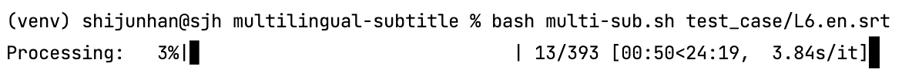
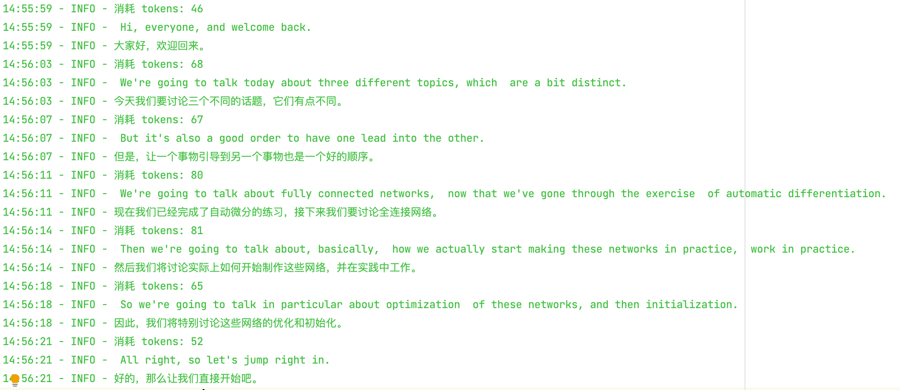
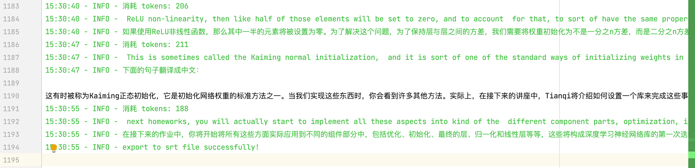

# multilingual-subtitle
基于 **gpt-3.5-turbo** 将 YouTube 自动生成的英文字幕、Whisper 自动识别的英文字幕转换为中文字幕或中英双语字幕脚本。 为什么不选择 YouTube 的中文字幕？传统的流式音频识别会有一些突兀的事实错误，且中文实时翻译的效果更差。希望 gpt 可以通过学习上下文来避免此类错误。

### 功能说明
目前有逐句翻译和逐段翻译两种策略。它们是成本和效率之间的权衡。
1. 逐句翻译和普通的翻译机器没有什么区别，但是翻译质量依赖于英文字幕的质量。比如有时候英文字幕比较杂乱，句子之间没有明确的分隔，这样得到的翻译质量也不会太好，第二个缺点是句子太短，请求太快会触发 openAI 的请求上限（虽然官网标的普通用户是 20RPM，但我每隔 5秒 请求一次也会触发警告，很迷！~~刚刚绑了信用卡，等我再试试付费用户的速率~~真的很快，再也没有 Rate Limited 了！）；

2. 逐段翻译可以保留上下文的信息，但是 AI 不太听话，小概率会在翻译的过程中删除句子之间的分隔符，导致我不能还原到对应的句子。第二个缺点是上下文信息太多会让 AI 把表达相近的两个句子翻译成一句话，因为英文本身就比较啰嗦，有时候会表达重复的意思。所以这里又写了一个脚本，可以在人工的基础上快速的让中文 align（其实目前没有什么好的办法更加智能，寄！）。

### 使用教程
#### 生成英文字幕文件
1. 使用 [you-get](https://github.com/soimort/you-get) 下载视频，字幕会和视频一起被下载
```bash
# 查看可以下载的信息，可以选择分辨率和文件等
you-get -i 'https://www.youtube.com/watch?v=jNQXAC9IVRw'
# 选择一个 itag 下载
you-get -itag=123 'https://www.youtube.com/watch?v=jNQXAC9IVRw'
```
2. 使用 [Whisper](https://github.com/openai/whisper) 识别并输出字幕文件
```bash
whisper YOUR_{VIDEO/AUDIO}_FILE --model {medium/large} --output_format srt
```
#### 设置 openAI 的 API
```bash
export OPENAI_API="sk_YOUR_SECRET_KEY"
```

#### 执行脚本进行翻译，输出双语字幕文件
```bash
python main.py --source_file=YOUR_SRT_FILE_PATH --target_file=OUTPUT_SRT_FILE_PATH
```
#### 运行效果
1. 在 Terminal 中执行

   
2. 输出的日志文件

   
GPT 感觉还是不太稳定，有时候会出现一些意想不到的错误。比如这一次的回答里出现了无关信息。感觉它的错误率在 0.1-1% 之间。

#### 对生成的字幕文件做校正
如果使用逐段翻译策略，很有可能最后生成的中文字幕没有对齐。打开输出的字幕文件在需要隔断的地方加“#”键，运行 align_script.py 脚本实现自动隔断。